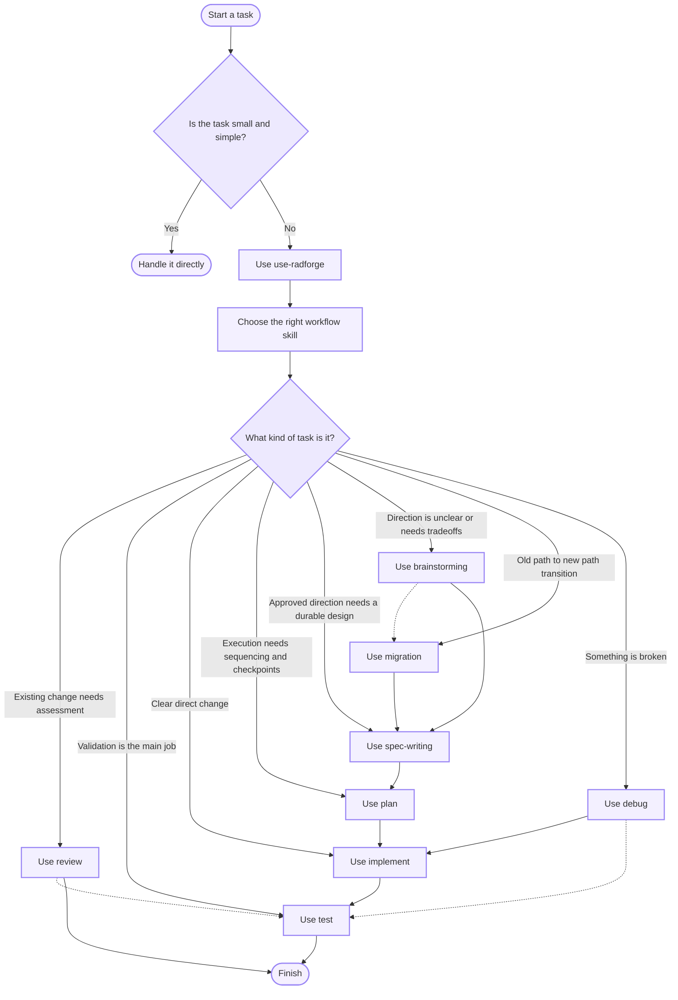

# Radforge

Radforge is a workflow skills framework for coding agents with clear routing, durable artifacts, and multi-provider installation support.

It packages a pragmatic workflow and skill library so supported agents can follow a consistent way of working.

## Quickstart

Install Radforge directly from GitHub with a single command.

## Supported Providers

Current installer support is for the provider user-level setup.

- Claude Code
- Codex
- Cursor
- GitHub Copilot
- OpenCode

## Install

Choose the provider you want, set it in the command below, and run the verified release installer.

The installer does not pick a default provider for you.

### Windows PowerShell

```powershell
$RadforgeVersion = "v1.4.3"
$RadforgeProvider = "codex"
$RadforgeAsset = "install.ps1"
$RadforgeBaseUrl = "https://github.com/tangthiendat/radforge/releases/download/$RadforgeVersion"
$RadforgeTempRoot = Join-Path ([System.IO.Path]::GetTempPath()) ("radforge-install-" + [guid]::NewGuid())

try {
    New-Item -ItemType Directory -Path $RadforgeTempRoot | Out-Null
    $RadforgeScript = Join-Path $RadforgeTempRoot $RadforgeAsset
    $RadforgeChecksum = "$RadforgeScript.sha256"
    Invoke-WebRequest "$RadforgeBaseUrl/$RadforgeAsset" -OutFile $RadforgeScript
    Invoke-WebRequest "$RadforgeBaseUrl/$RadforgeAsset.sha256" -OutFile $RadforgeChecksum
    $RadforgeExpectedHash = ((Get-Content -Raw $RadforgeChecksum).Trim() -split "\s+")[0]
    $RadforgeActualHash = (Get-FileHash $RadforgeScript -Algorithm SHA256).Hash
    if ($RadforgeActualHash -ne $RadforgeExpectedHash) { throw "Radforge installer checksum mismatch." }
    & $RadforgeScript -Provider $RadforgeProvider -ReleaseVersion $RadforgeVersion
}
finally {
    if (Test-Path $RadforgeTempRoot) { Remove-Item $RadforgeTempRoot -Recurse -Force }
}
```

### macOS Or Linux

```sh
set -eu

radforge_version="v1.4.3"
radforge_provider="codex"
radforge_asset="install.sh"
radforge_base_url="https://github.com/tangthiendat/radforge/releases/download/$radforge_version"
radforge_temp_root=$(mktemp -d)
trap 'rm -rf "$radforge_temp_root"' EXIT INT TERM

curl -fsSLo "$radforge_temp_root/$radforge_asset" "$radforge_base_url/$radforge_asset"
curl -fsSLo "$radforge_temp_root/$radforge_asset.sha256" "$radforge_base_url/$radforge_asset.sha256"
(
    cd "$radforge_temp_root"
    if command -v sha256sum >/dev/null 2>&1; then
        sha256sum -c "$radforge_asset.sha256"
    elif command -v shasum >/dev/null 2>&1; then
        shasum -a 256 -c "$radforge_asset.sha256"
    else
        printf 'sha256sum or shasum is required.\n' >&2
        exit 1
    fi
)
sh "$radforge_temp_root/$radforge_asset" --provider "$radforge_provider" --release-version "$radforge_version"
```

Provider values are `claude-code`, `codex`, `cursor`, `github-copilot`, and `opencode`.

### Install Script Options

Use these options when you want more than the single-provider commands above.

| Behavior                        | PowerShell                    | Shell                          |
| ------------------------------- | ----------------------------- | ------------------------------ |
| Install multiple providers      | `-Provider codex,claude-code` | `--provider codex,claude-code` |
| Preview changes without writing | `-Provider codex -DryRun`     | `--provider codex --dry-run`   |
| Select a release explicitly     | `-ReleaseVersion v1.4.3`      | `--release-version v1.4.3`     |

Provider values:

- `claude-code`
- `codex`
- `cursor`
- `github-copilot`
- `opencode`

If the expected provider folders do not exist yet, the installer creates them.

If a skill folder with the same name already exists and is not managed by Radforge, the installer leaves it alone and skips that skill.

### Preview without writing

### Windows PowerShell

Use the verified PowerShell install block above and add `-DryRun` to its final command.

### macOS Or Linux

Use the verified shell install block above and add `--dry-run` to its final command.

### Verify after install

After installing, open your coding tool and try this prompt:

```text
Tell me about Radforge.
```

If the installed skills are available, the agent should recognize Radforge and explain the workflow or available skills.

If your provider does not surface the skills automatically, try this instead:

```text
Use use-radforge and tell me which workflow skills are available.
```

## Uninstall

### Uninstall all installed providers

### Windows PowerShell

```powershell
$RadforgeVersion = "v1.4.3"
$RadforgeAsset = "uninstall.ps1"
$RadforgeBaseUrl = "https://github.com/tangthiendat/radforge/releases/download/$RadforgeVersion"
$RadforgeTempRoot = Join-Path ([System.IO.Path]::GetTempPath()) ("radforge-uninstall-" + [guid]::NewGuid())

try {
    New-Item -ItemType Directory -Path $RadforgeTempRoot | Out-Null
    $RadforgeScript = Join-Path $RadforgeTempRoot $RadforgeAsset
    $RadforgeChecksum = "$RadforgeScript.sha256"
    Invoke-WebRequest "$RadforgeBaseUrl/$RadforgeAsset" -OutFile $RadforgeScript
    Invoke-WebRequest "$RadforgeBaseUrl/$RadforgeAsset.sha256" -OutFile $RadforgeChecksum
    $RadforgeExpectedHash = ((Get-Content -Raw $RadforgeChecksum).Trim() -split "\s+")[0]
    $RadforgeActualHash = (Get-FileHash $RadforgeScript -Algorithm SHA256).Hash
    if ($RadforgeActualHash -ne $RadforgeExpectedHash) { throw "Radforge uninstaller checksum mismatch." }
    & $RadforgeScript
}
finally {
    if (Test-Path $RadforgeTempRoot) { Remove-Item $RadforgeTempRoot -Recurse -Force }
}
```

### macOS Or Linux

```sh
set -eu

radforge_version="v1.4.3"
radforge_asset="uninstall.sh"
radforge_base_url="https://github.com/tangthiendat/radforge/releases/download/$radforge_version"
radforge_temp_root=$(mktemp -d)
trap 'rm -rf "$radforge_temp_root"' EXIT INT TERM

curl -fsSLo "$radforge_temp_root/$radforge_asset" "$radforge_base_url/$radforge_asset"
curl -fsSLo "$radforge_temp_root/$radforge_asset.sha256" "$radforge_base_url/$radforge_asset.sha256"
(
    cd "$radforge_temp_root"
    if command -v sha256sum >/dev/null 2>&1; then
        sha256sum -c "$radforge_asset.sha256"
    elif command -v shasum >/dev/null 2>&1; then
        shasum -a 256 -c "$radforge_asset.sha256"
    else
        printf 'sha256sum or shasum is required.\n' >&2
        exit 1
    fi
)
sh "$radforge_temp_root/$radforge_asset"
```

### Uninstall specific providers

Use the same provider values as install:

- `claude-code`
- `codex`
- `cursor`
- `github-copilot`
- `opencode`

### Windows PowerShell

Use the verified PowerShell uninstall block above and pass `-Provider codex,claude-code` to its final command.

### macOS Or Linux

Use the verified shell uninstall block above and pass `--provider codex,opencode` to its final command.

## How It Works

Radforge installs a shared skill library into the user-level skills directory for each provider you select.

After install, the usual flow is:

1. Install Radforge for one or more supported providers.
2. Start a task in your coding tool.
3. If the provider exposes installed skills, the agent can discover `use-radforge`.
4. If it does not route automatically, ask the agent to use `use-radforge` first for non-trivial work.
5. `use-radforge` picks one primary workflow skill and hands off immediately.

This release uses bootstrap routing through `use-radforge`.

Small, clear, low-risk tasks can still be handled directly without using the full workflow.

The diagram below is a high-level routing sketch. Actual handoffs can skip, stop, or route differently based on approval state, validation needs, or repository-local workflow rules. Dashed arrows show common secondary handoffs rather than the default primary path.

For standalone diagram docs, see [docs/radforge-high-level-orchestration.md](docs/radforge-high-level-orchestration.md) and [docs/radforge-full-orchestration.md](docs/radforge-full-orchestration.md).



For non-trivial work, the routing guide is:

- use `review` when you need to assess existing changes for bugs, regressions, missing validation, or rollout risk
- start in `brainstorming` when the direction, scope, or approval is still unclear
- use `spec-writing` when the direction is mostly decided and you still need a durable design in `docs/specs/`
- use `migration` when moving from an old path to a new one and compatibility, cutover, or rollback is the hard part
- move to `plan` when the direction is already clear and the remaining job is execution structure
- stay in `implement` when one bounded checkpoint plus one local smoke-style check is enough to support the claim
- hand off to `test` when you need broader proof or more regression confidence

Repository-local instructions still take priority over user-level Radforge defaults.

## What's Inside

### Workflow Skills

- `migration`: manages old-path to new-path transitions with compatibility, cutover, rollback, and rollout thinking
- `review`: inspects existing changes for bugs, regressions, missing validation, and rollout risk
- `brainstorming`: clarifies direction, scope, and approval before execution
- `spec-writing`: turns approved or nearly approved direction into a durable design artifact
- `plan`: organizes approved or already-clear work into resumable execution structure
- `implement`: executes clear changes inside a bounded checkpoint
- `test`: validates changes when broader proof or regression confidence is needed
- `debug`: reproduces and isolates failures before fixing them

### Bootstrap Skill

- `use-radforge`: the bootstrap router for non-trivial work

### Workflow Closeout

- once Radforge workflow is in use, non-trivial work should report what changed, what was validated, what was skipped, and any remaining risk

## What Gets Installed

For each selected provider, the installer:

- copies every skill from `skills/` into the provider's user-level skills directory
- installs `use-radforge` alongside the core workflow skills
- records uninstall metadata in `~/.radforge/providers/<provider>.state`

The installer is additive and conservative:

- it only replaces skill directories that are already managed by Radforge
- it removes only Radforge-owned installed skill directories during uninstall
- it can clean up legacy provider hint blocks from older installs when you reinstall
- it does not replace repository-local instructions

## Updating Radforge

Rerun install with the same explicit provider values to refresh the installed skill copies.

Use the same install script options from `Install Script Options` when you want to target specific providers or preview the update.

If you are updating from an older version that used installer-managed provider hints, rerun install once to remove the legacy hint blocks.

### Windows PowerShell

Use the verified PowerShell install block and select the providers in its final command.

### macOS Or Linux

Use the verified shell install block and select the providers in its final command.

If you want to preview an update first, use the dry-run commands from the install section.

## Notes

- install requires an explicit provider selection; the installer does not choose providers automatically
- uninstall uses the stored provider state files in `~/.radforge/providers/` to remove only Radforge-managed assets
- actual skill auto-invocation still depends on the provider surfacing installed skills to the model for that session
