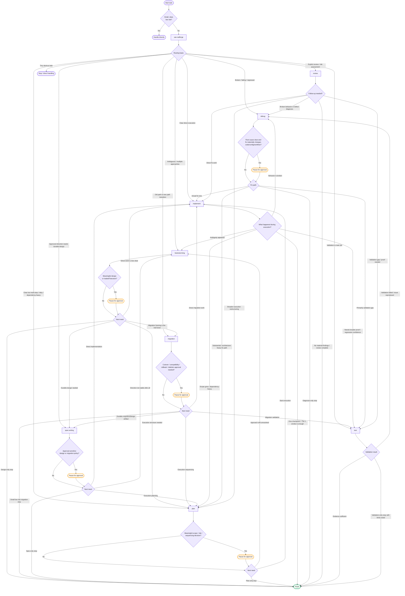

# Radforge Full Orchestration

This document captures the fuller orchestration implied by `AGENTS.md` and the core workflow skill files.

Use this version when you want the broader workflow state machine, including approval gates, conditional stops, and validation-driven handoffs.

Notes:

- This is the fuller orchestration view, not the simplified README teaching diagram.
- `use-radforge` selects one primary next skill.
- Approval pauses are conditional gates, not mandatory on every path.
- Repository-local rules can override the default Radforge flow.
