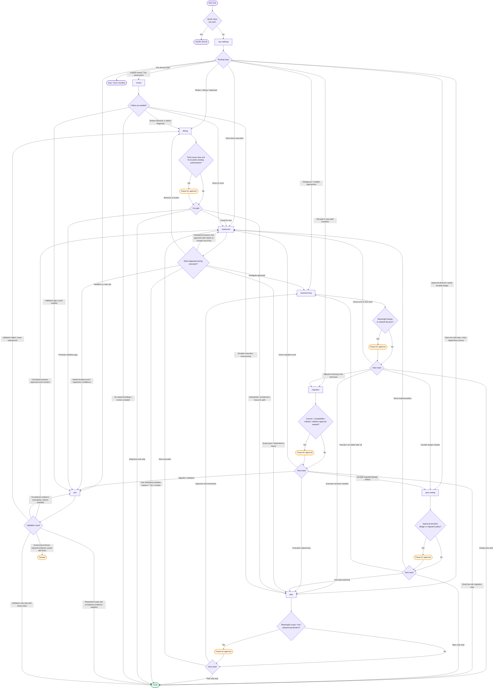

# Radforge Full Orchestration

This document captures the fuller orchestration implied by `AGENTS.md` and the core workflow skill files.

Use this version when you want the broader workflow state machine, including approval gates, conditional stops, and validation-driven handoffs.

```mermaid
flowchart TD
    A([Start task]) --> B{Small, clear,<br/>low risk?}
    B -- Yes --> DIRECT([Handle directly])
    B -- No --> UR[use-radforge]

    UR --> ROUTE{Routing basis}

    ROUTE -->|Broken / failing / regressed| DEBUG[debug]
    ROUTE -->|Explicit review / risk assessment| REVIEW[review]
    ROUTE -->|Ambiguous / multiple approaches| BRAIN[brainstorming]
    ROUTE -->|Old path to new path transition| MIG[migration]
    ROUTE -->|Approved direction needs durable design| SPEC[spec-writing]
    ROUTE -->|Validation is main job| TEST[test]
    ROUTE -->|Clear but multi-step / risky / dependency-heavy| PLAN[plan]
    ROUTE -->|Clear direct execution| IMPL[implement]
    ROUTE -->|Tiny obvious task| SKIP([Stop / direct handling])

    BRAIN --> BRAIN_APPROVAL{Meaningful design<br/>or tradeoff decision?}
    BRAIN_APPROVAL -- Yes --> USER_APPROVAL([Pause for approval])
    BRAIN_APPROVAL -- No --> BRAIN_NEXT{Next need}
    USER_APPROVAL --> BRAIN_NEXT
    BRAIN_NEXT -->|Durable design needed| SPEC
    BRAIN_NEXT -->|Migration framing is the real issue| MIG
    BRAIN_NEXT -->|Execution structure needed| PLAN
    BRAIN_NEXT -->|Direct work is now clear| IMPL
    BRAIN_NEXT -->|Design-only stop| DONE([Finish])

    MIG --> MIG_APPROVAL{Cutover / compatibility /<br/>rollback / deletion approval needed?}
    MIG_APPROVAL -- Yes --> USER_APPROVAL2([Pause for approval])
    MIG_APPROVAL -- No --> MIG_NEXT{Next need}
    USER_APPROVAL2 --> MIG_NEXT
    MIG_NEXT -->|Durable migration/design artifact| SPEC
    MIG_NEXT -->|Execution sequencing| PLAN
    MIG_NEXT -->|Direct migration work| IMPL
    MIG_NEXT -->|Migration validation| TEST
    MIG_NEXT -->|Small low-risk migration stop| DONE

    SPEC --> SPEC_APPROVAL{Approval-sensitive<br/>design or migration policy?}
    SPEC_APPROVAL -- Yes --> USER_APPROVAL3([Pause for approval])
    SPEC_APPROVAL -- No --> SPEC_NEXT{Next need}
    USER_APPROVAL3 --> SPEC_NEXT
    SPEC_NEXT -->|Execution planning| PLAN
    SPEC_NEXT -->|Direct implementation| IMPL
    SPEC_NEXT -->|Direction not stable after all| BRAIN
    SPEC_NEXT -->|Spec-only stop| DONE

    PLAN --> PLAN_APPROVAL{Meaningful scope / risk /<br/>sequencing decision?}
    PLAN_APPROVAL -- Yes --> USER_APPROVAL4([Pause for approval])
    PLAN_APPROVAL -- No --> PLAN_NEXT{Next need}
    USER_APPROVAL4 --> PLAN_NEXT
    PLAN_NEXT -->|Approach still unresolved| BRAIN
    PLAN_NEXT -->|Start execution| IMPL
    PLAN_NEXT -->|Plan-only stop| DONE

    IMPL --> IMPL_CHECK{What happened during execution?}
    IMPL_CHECK -->|One checkpoint satisfies request + Tier 1 smoke| DONE
    IMPL_CHECK -->|Checkpoint passed; next approved task needs no broader proof first| IMPL
    IMPL_CHECK -->|Needs broader proof / regression confidence| TEST
    IMPL_CHECK -->|Ambiguity appeared| BRAIN
    IMPL_CHECK -->|Scope grew / dependency-heavy| PLAN
    IMPL_CHECK -->|Behavior is broken| DEBUG

    DEBUG --> DEBUG_APPROVAL{Root cause clear and<br/>fix exceeds existing authorization?}
    DEBUG_APPROVAL -- Yes --> USER_APPROVAL5([Pause for approval])
    DEBUG_APPROVAL -- No --> DEBUG_NEXT{Fix path}
    USER_APPROVAL5 --> DEBUG_NEXT
    DEBUG_NEXT -->|Actual fix now| IMPL
    DEBUG_NEXT -->|Primarily validation gap| TEST
    DEBUG_NEXT -->|Substantial / architecture-heavy fix path| PLAN
    DEBUG_NEXT -->|Diagnosis-only stop| DONE

    REVIEW --> REVIEW_NEXT{Follow-up needed?}
    REVIEW_NEXT -->|No material findings / review complete| DONE
    REVIEW_NEXT -->|Broken behavior or defect diagnosis| DEBUG
    REVIEW_NEXT -->|Direct fix work| IMPL
    REVIEW_NEXT -->|Validation gap / proof needed| TEST
    REVIEW_NEXT -->|Broader execution restructuring| PLAN

    TEST --> TEST_NEXT{Validation result}
    TEST_NEXT -->|Checkpoint passed; approved work remains| IMPL
    TEST_NEXT -->|Requested scope and acceptance evidence satisfied| DONE
    TEST_NEXT -->|Acceptance evidence incomplete; checks available| TEST
    TEST_NEXT -->|Validation failed / issue reproduced| DEBUG
    TEST_NEXT -->|Validation-only stop with limits noted| DONE
    TEST_NEXT -->|Environment blocks required evidence; pause with limits| PAUSED([Paused])

    classDef startNode fill:#f5f0ff,stroke:#8b6cf0,stroke-width:2px,color:#222;
    classDef decisionNode fill:#ede9fe,stroke:#8b6cf0,stroke-width:2px,color:#222;
    classDef skillNode fill:#f3f0ff,stroke:#8b6cf0,stroke-width:2px,color:#222;
    classDef pauseNode fill:#fff7ed,stroke:#f59e0b,stroke-width:2px,color:#222;
    classDef finishNode fill:#eefcf3,stroke:#22a06b,stroke-width:2px,color:#222;

    class A,DIRECT,SKIP startNode;
    class ROUTE,B,BRAIN_APPROVAL,MIG_APPROVAL,SPEC_APPROVAL,PLAN_APPROVAL,IMPL_CHECK,DEBUG_APPROVAL,REVIEW_NEXT,TEST_NEXT,BRAIN_NEXT,MIG_NEXT,SPEC_NEXT,PLAN_NEXT,DEBUG_NEXT decisionNode;
    class UR,DEBUG,REVIEW,BRAIN,MIG,SPEC,TEST,PLAN,IMPL skillNode;
    class USER_APPROVAL,USER_APPROVAL2,USER_APPROVAL3,USER_APPROVAL4,USER_APPROVAL5 pauseNode;
    class PAUSED pauseNode;
    class DONE finishNode;
```

Notes:

- This is the fuller orchestration view, not the simplified README teaching diagram.
- `use-radforge` selects one primary next skill.
- Approval pauses are conditional gates, not mandatory on every path.
- Handoffs preserve the original task context and existing authorization. Checkpoint validation resumes approved work; only satisfied requested scope supports completion. Explicit checkpoint-only requests stop with remaining work reported.
- Debugging checks mutation scope before reproduction or experiments, prefers read-only checks and isolation, and restores only agent-owned experimental changes before the next hypothesis or handoff unless retention is authorized. Unresolved restoration stops further mutation and is reported.
- Repository-local rules can override the default Radforge flow.
