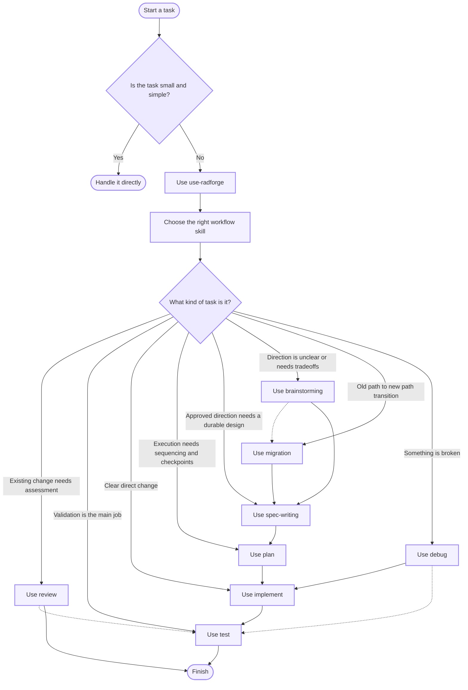

# Radforge High-Level Orchestration

This document mirrors the simplified orchestration view shown in the README.

Use this version when you want a quick routing overview rather than the full workflow state machine.

Notes:

- Solid arrows show the primary teaching path.
- Dashed arrows show common secondary handoffs.
- Repository-local workflow rules can still override this view.
